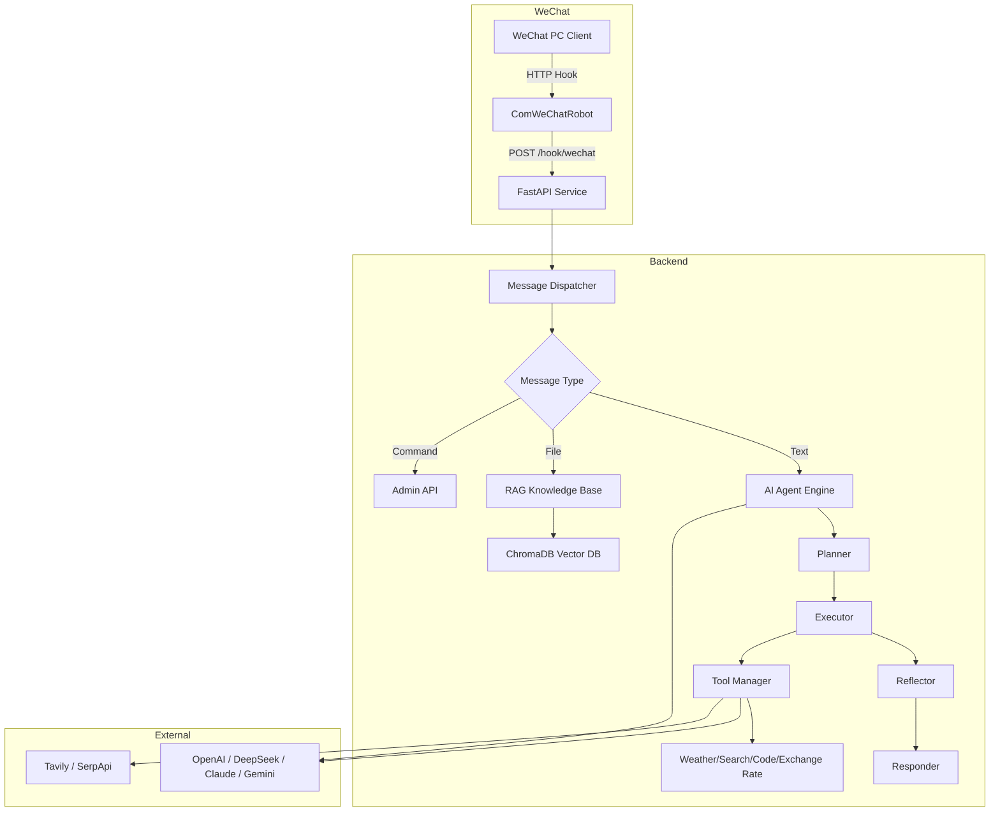

<p align="center">
  
  
  
  
  
</p>

<h1 align="center">🤖 WeChat AI Bot</h1>

<h3 align="center">
  <s>Not just another WeChat chatbot</s> — Turn your WeChat into an <strong>AI Agent Workstation</strong>
</h3>

<p align="center">
  <strong>ComWeChatRobot + FastAPI + LangGraph + ChromaDB</strong><br>
  Multi-model orchestration · Battle Mode · RAG Knowledge Base · Chain-of-Thought Visualization · One-click multi-platform distribution
</p>

<p align="center">
  <a href="https://huggingface.co/spaces/xiehuaian77-sketch/wechat-ai-bot">
    
  </a>
  <a href="https://github.com/xiehuaian77-sketch/wechat-ai-bot/blob/main/README.en.md">
    
  </a>
  <a href="https://github.com/xiehuaian77-sketch/wechat-ai-bot/blob/main/CONTRIBUTING.md">
    
  </a>
  <a href="https://github.com/xiehuaian77-sketch/wechat-ai-bot/issues">
    
  </a>
</p>

---

## 🎬 See it in action

<p align="center">
  <!-- TODO: Record demo GIF and replace src below -->
  
</p>

> **Demo video coming soon**. Star the repo to stay updated: [Bilibili](https://www.bilibili.com) | [YouTube](https://www.youtube.com)

**3 core scenarios**:
1. **🤖 Smart Chat**: Send a message to the bot, and it automatically calls GPT-4 / DeepSeek / Claude to reply with multi-turn context
2. **⚔️ Battle Mode**: Two AI models compete side by side, you act as the judge and vote for the best answer
3. **📚 Knowledge Base Q&A**: Upload PDF/Word/CSV files and instantly transform them into a dedicated RAG knowledge base for WeChat Q&A

---

## ⚡️ Why choose WeChat AI Bot?

| Feature | Description | Status |
|---------|-------------|--------|
| 🧠 **Multi-model Orchestration** | 9 Providers, 32+ models, Planner → Executor → Reflector → Responder 4-stage Agent | ✅ |
| ⚔️ **Battle Mode** | Dual model PK, AI vs AI, you are the judge | ✅ |
| 🔍 **RAG Knowledge Base** | ChromaDB vector retrieval, upload PDF/Word/CSV for instant knowledge base | ✅ |
| 🎨 **CoT Visualization** | Chain-of-thought frame-by-frame expansion, see how AI thinks | ✅ |
| 📱 **Mobile Friendly** | Send messages in WeChat, manage Agent on mobile | ✅ |
| 🔌 **SSE Streaming** | Typewriter effect, zero-latency perception | ✅ |
| 🛡️ **Enterprise-grade Reliability** | Circuit breaker + auto-reconnect + rate limiting + permission control | ✅ |
| 🐳 **One-click Docker Deploy** | Complete production environment with ChromaDB + Nginx + HTTPS | ✅ |

---

## 🚀 Quick Start

### Prerequisites

- Python 3.12+
- [uv](https://docs.astral.sh/uv/) package manager (or pip)
- ComWeChatRobot PC client (for WeChat message reception)

### 1. Clone & Install

```bash
git clone https://github.com/xiehuaian77-sketch/wechat-ai-bot.git
cd wechat-ai-bot
uv sync
```

### 2. Configure Environment

```bash
cp config/.env.example .env
# Fill in your API Keys (at least one required)
```

### 3. Start Service

```bash
# Development mode (hot reload)
uv run uvicorn app.main:app --reload --host 0.0.0.0 --port 8000

# Production mode (4 workers)
uv run uvicorn app.main:app --host 0.0.0.0 --port 8000 --workers 4
```

### 4. One-click Docker

```bash
# Start complete environment (including ChromaDB + Nginx)
docker compose up -d
```

---

## 🏗️ Architecture Overview



**Tech Stack**:
- **Backend**: FastAPI + Uvicorn (async high-performance)
- **AI Orchestration**: LangGraph state machine (4-node workflow)
- **Vector DB**: ChromaDB (local persistence, no extra service needed)
- **Database**: SQLAlchemy 2.0 + aiosqlite (conversation history, permissions, logs)
- **Config**: Pydantic v2 Settings (env variables + `.env`)
- **Deploy**: Docker Compose (one-click + Nginx reverse proxy)

---

## 📖 Usage Examples

### Example 1: Basic Chat

**User** (via WeChat):
```
What's the weather in Beijing today?
```

**Bot** (auto-reply):
```
🌤 Beijing Today: Sunny, 22°C, humidity 45%, perfect for going out!

(via Weather tool + DeepSeek V3)
```

### Example 2: Battle Mode

**User** (via WeChat):
```
@battle GPT-4 vs Claude-3.5-Sonnet: Will quantum computing replace classical computers?
```

**Bot** (dual model PK results):
```
⚔️ Battle Mode Results:

🤖 GPT-4:
Quantum computing will not completely replace classical computers, but will complement them in specific fields (cryptography, drug development, financial modeling)...

🤖 Claude-3.5-Sonnet:
Classical computers will remain mainstream in the foreseeable future, with quantum computing better suited as specialized accelerators...

📊 Your vote: Claude-3.5-Sonnet ✅
```

### Example 3: RAG Knowledge Base

**User** (upload file + ask):
```
[Upload product_manual.pdf]
What is the warranty period for this product?
```

**Bot** (auto retrieval + answer):
```
📄 According to "Product Manual" Section 3.2:
This product comes with a 2-year limited warranty from the date of purchase.
(Confidence: 92%)
```

---

## 🗺️ Roadmap

| Phase | Content | Status |
|-------|---------|--------|
| ① | Project init + FastAPI skeleton + config management | ✅ Done |
| ② | ComWeChatRobot Hook integration + message parsing | ✅ Done |
| ③ | AI multi-turn conversation (multi-model support) | ✅ Done |
| ④ | LangGraph Agent engine (4-node workflow) | ✅ Done |
| ⑤ | Function Calling tools (5+ tools) | ✅ Done |
| ⑥ | RAG Knowledge Base (ChromaDB + hybrid retrieval) | ✅ Done |
| ⑦ | Admin dashboard + permission control + rate limiting | ✅ Done |
| ⑧ | Production deploy (Docker + CI/CD) | 🔜 In Progress |
| ⑨ | Multimodal support (image/voice + one-click distribution) | 📋 Planned |

---

## 🤝 Contributing

We welcome all forms of contribution! Whether it's bug fixes, new features, documentation improvements, or UI optimization.

### 🚀 5-minute quick contribution

1. **Fork** this repo
2. Create branch: `git checkout -b feat/your-feature`
3. Commit: `git commit -m "feat: add your feature"`
4. Push: `git push origin feat/your-feature`
5. **Open a PR** and wait for Review

### 🎯 Contribution types

| Type | Description | Labels |
|------|-------------|--------|
| 🐛 Bug Fix | Fix issues in existing features | `bug` |
| ✨ Feature | Add new feature modules | `enhancement` |
| 📝 Docs | Typos, add examples, translation | `documentation` |
| 🎨 UI/UX | Frontend interface optimization | `ui` |
| 🔧 DevOps | Docker, CI/CD, monitoring | `devops` |
| 🧪 Testing | Unit tests, integration tests | `testing` |

### 💡 No ideas?

Check our [Ideas list](https://github.com/xiehuaian77-sketch/wechat-ai-bot/discussions/categories/ideas) or [Good First Issues](https://github.com/xiehuaian77-sketch/wechat-ai-bot/labels/good%20first%20issue).

---

## 📊 Community & Sharing

### Join the discussion

- **GitHub Discussions**: [Ask questions, share use cases, request features](https://github.com/xiehuaian77-sketch/wechat-ai-bot/discussions)
- **Twitter/X**: [@xiehuaian77](https://twitter.com/xiehuaian77) — Follow for updates
- **Juejin**: [Technical blog series](https://juejin.cn/user/713649897585054) — Architecture design and tutorials
- **V2EX**: [Project discussion thread](https://www.v2ex.com/t/wechat-ai-bot) — Join the conversation

### If you like this project

- **Give a Star** ⭐ — It's the biggest encouragement for us
- **Share with friends** — Let more people know about this project
- **Submit a PR** — Let's make it better together

---

## 🔒 Security & Privacy

- All message data is stored locally in SQLite + ChromaDB, not uploaded to the cloud
- API Keys are managed via `.env`, not committed to Git
- Admin whitelist/blacklist supported to prevent abuse
- For detailed security configuration, see [SECURITY.md](SECURITY.md)

---

## 📄 License

MIT © [xiehuaian77-sketch](https://github.com/xiehuaian77-sketch)

---

## 🙏 Acknowledgments

- [ComWeChatRobot](https://github.com/WeChat-Shot/ComWeChatRobot) — WeChat PC client automation framework
- [LangChain](https://python.langchain.com/) + [LangGraph](https://langchain-ai.github.io/langgraph/) — AI Agent orchestration engine
- [ChromaDB](https://www.trychroma.com/) — Vector database
- [FastAPI](https://fastapi.tiangolo.com/) — Modern Python web framework

---

<p align="center">
  <!-- TODO: Deploy to HuggingFace Space, then enable below -->
  <!-- <a href="https://huggingface.co/spaces/xiehuaian77-sketch/wechat-ai-bot">
    
  </a> -->
  <a href="https://github.com/xiehuaian77-sketch/wechat-ai-bot">
    
  </a>
</p>

<p align="center">
  Made with ❤️ by <a href="https://github.com/xiehuaian77-sketch">xiehuaian77-sketch</a> and <a href="https://github.com/xiehuaian77-sketch/wechat-ai-bot/graphs/contributors">contributors</a>
</p>
