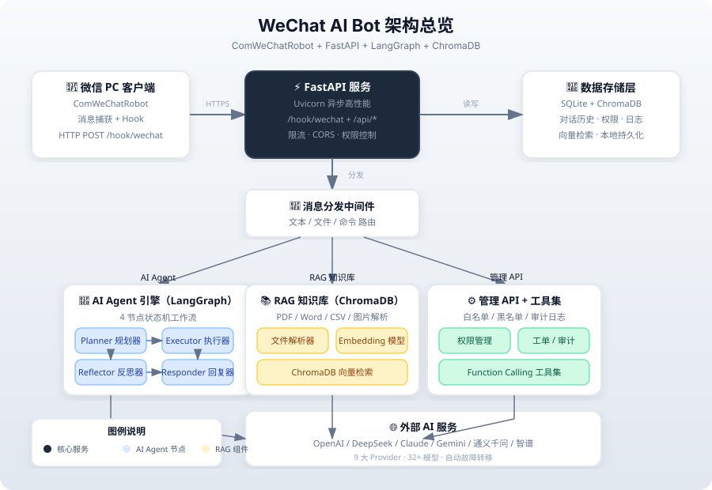
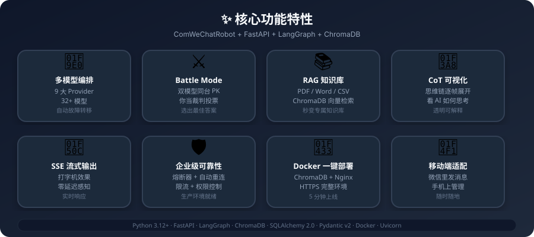
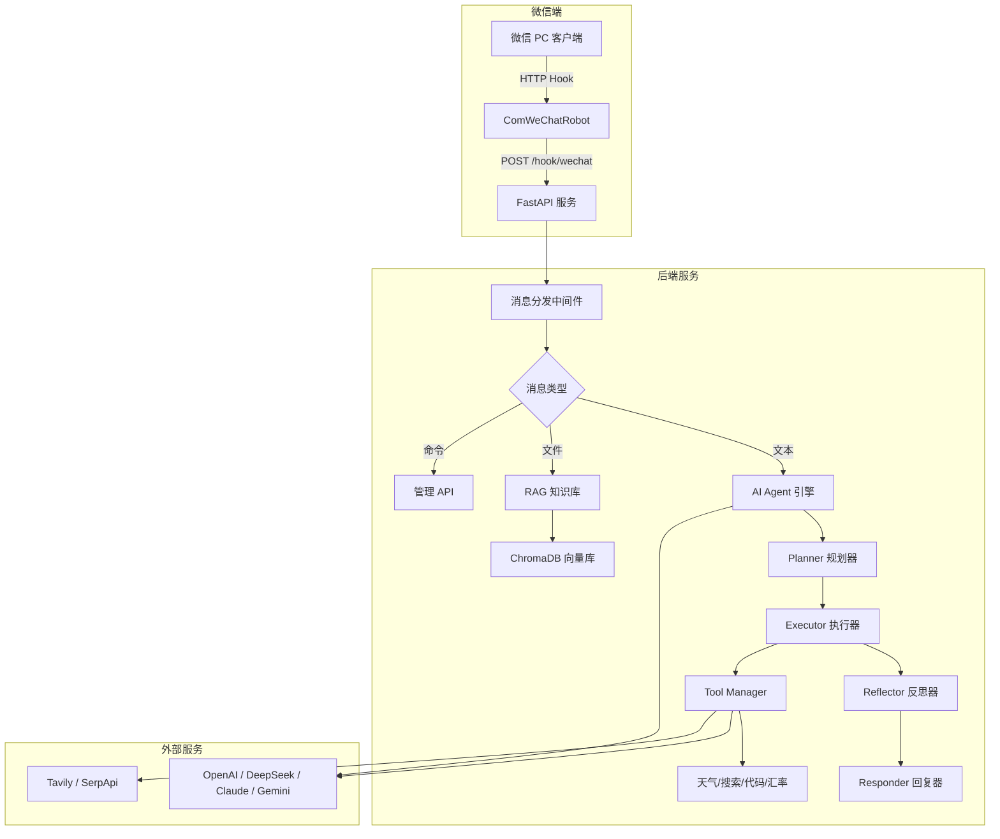

<p align="center">
  
  
  
  
  
</p>

<h1 align="center">🤖 WeChat AI Bot</h1>

<h3 align="center">
  <s>不是又一个微信聊天机器人</s> — 把你的微信变成 <strong>AI Agent 工作台</strong>
</h3>

<p align="center">
  <strong>ComWeChatRobot + FastAPI + LangGraph + ChromaDB</strong><br>
  多模型编排 · Battle Mode · RAG 知识库 · 思维链可视化 · 一键多平台分发
</p>

<p align="center">
  
</p>

<!-- TODO: 部署到 HuggingFace Space 后替换下方链接 -->
<!-- <a href="https://huggingface.co/spaces/xiehuaian77-sketch/wechat-ai-bot">
    
  </a> -->
  <a href="https://github.com/xiehuaian77-sketch/wechat-ai-bot/blob/main/README.md">
    
  </a>
  <a href="https://github.com/xiehuaian77-sketch/wechat-ai-bot/blob/main/CONTRIBUTING.md">
    
  </a>
  <a href="https://github.com/xiehuaian77-sketch/wechat-ai-bot/issues">
    
  </a>
</p>

---

## 🎬 15 秒看懂它能做什么

<p align="center">
  
</p>

> **架构一目了然**：微信消息 → FastAPI → LangGraph Agent / RAG 知识库 / 管理 API → 32+ AI 模型 + ChromaDB

**3 个核心场景**：
1. **🤖 智能对话**：发微信给 Bot，自动调用 GPT-4 / DeepSeek / Claude 回复，支持多轮上下文
2. **⚔️ Battle Mode**：两个 AI 模型同台 PK，你当裁判投票，选出最佳答案
3. **📚 知识库问答**：上传 PDF/Word/CSV，秒变专属 RAG 知识库，微信里直接提问

---

<p align="center">
  
</p>

## ⚡️ 为什么选择 WeChat AI Bot？

| 特性 | 说明 | 状态 |
|------|------|------|
| 🧠 **多模型编排** | 9 大 Provider、32+ 模型，Planner → Executor → Reflector → Responder 四阶段 Agent | ✅ |
| ⚔️ **Battle Mode** | 双模型同台 PK，AI 对 AI，你当裁判 | ✅ |
| 🔍 **RAG 知识库** | ChromaDB 向量检索，上传 PDF/Word/CSV 秒变专属知识库 | ✅ |
| 🎨 **CoT 可视化** | 思维链逐帧展开，看 AI 如何思考 | ✅ |
| 📱 **移动端适配** | 微信里发消息，手机上管理 Agent | ✅ |
| 🔌 **SSE 流式输出** | 打字机效果，零延迟感知 | ✅ |
| 🛡️ **企业级可靠性** | 熔断器 + 自动重连 + 限流 + 权限控制 | ✅ |
| 🐳 **Docker 一键部署** | 包含 ChromaDB、Nginx、HTTPS 的完整生产环境 | ✅ |

---

## 🚀 3 分钟快速开始

### 前置要求

- Python 3.12+
- [uv](https://docs.astral.sh/uv/) 包管理器（或 pip）
- ComWeChatRobot PC 客户端（用于微信消息接收）

### 1. 克隆项目 & 安装依赖

```bash
git clone https://github.com/xiehuaian77-sketch/wechat-ai-bot.git
cd wechat-ai-bot
uv sync
```

### 2. 配置环境变量

```bash
cp config/.env.example .env
# 填入你的 API Key（至少需要一个）
```

### 3. 启动服务

```bash
# 开发模式（热重载）
uv run uvicorn app.main:app --reload --host 0.0.0.0 --port 8000

# 生产模式（4 workers）
uv run uvicorn app.main:app --host 0.0.0.0 --port 8000 --workers 4
```

### 4. 一键体验（Docker）

```bash
# 克隆后直接启动完整环境（含 ChromaDB + Nginx）
docker compose up -d
```

---

## 🏗️ 架构总览



**技术栈**：
- **后端框架**：FastAPI + Uvicorn（异步高性能）
- **AI 编排**：LangGraph 状态机（4 节点工作流）
- **向量数据库**：ChromaDB（本地持久化，无需额外服务）
- **数据库**：SQLAlchemy 2.0 + aiosqlite（对话历史、权限、日志）
- **配置管理**：Pydantic v2 Settings（环境变量 + `.env`）
- **部署**：Docker Compose（一键启动 + Nginx 反向代理）

---

## 📖 使用示例

### 示例 1：基础对话

**用户**（微信发送）：
```
今天北京天气怎么样？
```

**Bot**（自动回复）：
```
🌤 北京今日天气：晴，气温 22°C，湿度 45%，适合出行！

（via 天气工具 + DeepSeek V3）
```

### 示例 2：Battle Mode

**用户**（微信发送）：
```
@battle GPT-4 vs Claude-3.5-Sonnet：量子计算会取代经典计算机吗？
```

**Bot**（双模型 PK 结果）：
```
⚔️ Battle Mode 结果：

🤖 GPT-4：
量子计算不会完全取代经典计算机，而是会在特定领域（密码学、药物研发、金融建模）形成互补...

🤖 Claude-3.5-Sonnet：
经典计算机在可预见的未来仍将是主流，量子计算更适合作为专用加速器...

📊 你的投票：Claude-3.5-Sonnet ✅
```

### 示例 3：RAG 知识库

**用户**（上传文件 + 提问）：
```
[上传产品手册.pdf]
这个产品的保修期是多久？
```

**Bot**（自动检索 + 回答）：
```
📄 根据《产品手册》第 3.2 节：
本产品提供 2 年有限保修，自购买日期起计算。
（检索置信度：92%）
```

---

## 🗺️ 开发路线图

| 阶段 | 内容 | 状态 |
|------|------|------|
| ① | 项目初始化 + FastAPI 骨架 + 配置管理 | ✅ 完成 |
| ② | ComWeChatRobot Hook 接入 + 消息解析 | ✅ 完成 |
| ③ | AI 多轮对话（多模型支持） | ✅ 完成 |
| ④ | LangGraph Agent 引擎（4 节点工作流） | ✅ 完成 |
| ⑤ | Function Calling 工具集（5+ 工具） | ✅ 完成 |
| ⑥ | RAG 知识库（ChromaDB + 混合检索） | ✅ 完成 |
| ⑦ | 管理后台 + 权限控制 + 限流 | ✅ 完成 |
| ⑧ | 生产部署（Docker + CI/CD） | 🔜 进行中 |
| ⑨ | 多模态支持（图片/语音 + 一键分发） | 📋 规划中 |

---

## 🤝 贡献指南

我们欢迎所有形式的贡献！无论是 Bug 修复、新功能、文档改进还是 UI 优化。

### 🚀 5 分钟快速贡献

1. **Fork** 本仓库
2. 创建分支：`git checkout -b feat/your-feature`
3. 提交：`git commit -m "feat: add your feature"`
4. 推送：`git push origin feat/your-feature`
5. **提一个 PR**，等待 Review

### 🎯 贡献类型

| 类型 | 说明 | 标签 |
|------|------|------|
| 🐛 Bug 修复 | 修复现有功能的问题 | `bug` |
| ✨ 新功能 | 新增功能模块 | `enhancement` |
| 📝 文档改进 | 错别字、补充示例、翻译 | `documentation` |
| 🎨 UI/UX | 前端界面优化 | `ui` |
| 🔧 DevOps | Docker、CI/CD、监控 | `devops` |
| 🧪 测试 | 单元测试、集成测试 | `testing` |

### 💡 没有头绪？

看看我们的 [Ideas 列表](https://github.com/xiehuaian77-sketch/wechat-ai-bot/discussions/categories/ideas) 或 [Good First Issues](https://github.com/xiehuaian77-sketch/wechat-ai-bot/labels/good%20first%20issue)。

---

## 📊 社区与传播

### 加入讨论

- **GitHub Discussions**：[提问、分享用例、请求新功能](https://github.com/xiehuaian77-sketch/wechat-ai-bot/discussions)
- **Twitter/X**：[@xiehuaian77](https://twitter.com/xiehuaian77) — 关注获取更新
- **掘金**：[技术博客系列](https://juejin.cn/user/713649897585054) — 架构设计与实战教程
- **V2EX**：[项目讨论帖](https://www.v2ex.com/t/wechat-ai-bot) — 参与社区讨论

### 如果你喜欢这个项目

- **给个 Star** ⭐ — 这是对我们最大的鼓励
- **分享给朋友** — 让更多人知道这个项目
- **提交 PR** — 一起把它变得更好

---

## 🔒 安全与隐私

- 所有消息数据存储在本地 SQLite + ChromaDB，不上传云端
- API Key 通过 `.env` 管理，不上传到 Git
- 支持管理员白名单/黑名单，防止滥用
- 详细安全配置请见 [SECURITY.md](SECURITY.md)

---

## 📄 License

MIT © [xiehuaian77-sketch](https://github.com/xiehuaian77-sketch)

---

## 🙏 致谢

- [ComWeChatRobot](https://github.com/WeChat-Shot/ComWeChatRobot) — 微信 PC 客户端自动化框架
- [LangChain](https://python.langchain.com/) + [LangGraph](https://langchain-ai.github.io/langgraph/) — AI Agent 编排引擎
- [ChromaDB](https://www.trychroma.com/) — 向量数据库
- [FastAPI](https://fastapi.tiangolo.com/) — 现代 Python Web 框架

---

## 📋 开源准备

- [GitHub 仓库配置指南](docs/GITHUB_SETUP.md) —  Topics、Social Preview、Release
- [开源发布 Checklist](FOSS_OPENING_CHECKLIST.md) — 发布前逐项确认
- [演示录制指南](DEMO_GUIDE.md) — 15 秒 GIF 制作教程

---

<p align="center">
  <!-- TODO: 部署 HuggingFace Space 后启用下方链接 -->
  <!-- <a href="https://huggingface.co/spaces/xiehuaian77-sketch/wechat-ai-bot">
    
  </a> -->
  <a href="https://github.com/xiehuaian77-sketch/wechat-ai-bot">
    
  </a>
</p>

<p align="center">
  Made with ❤️ by <a href="https://github.com/xiehuaian77-sketch">xiehuaian77-sketch</a> and <a href="https://github.com/xiehuaian77-sketch/wechat-ai-bot/graphs/contributors">contributors</a>
</p>
